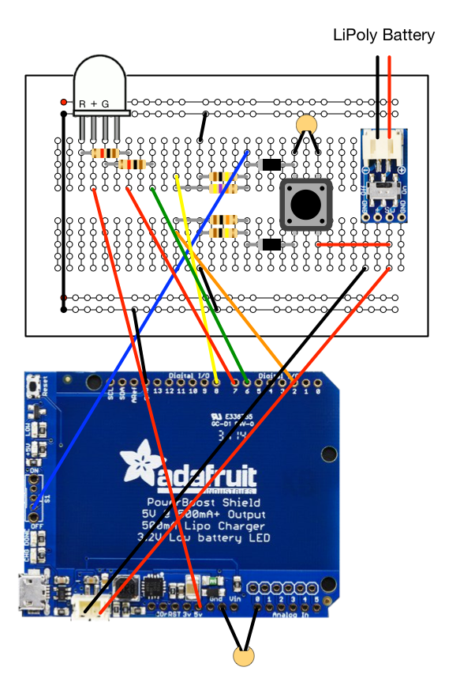
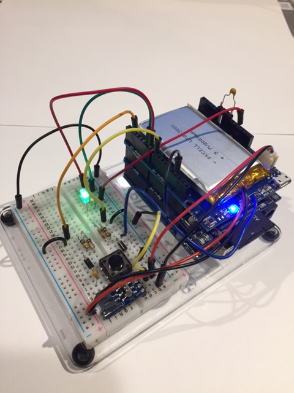
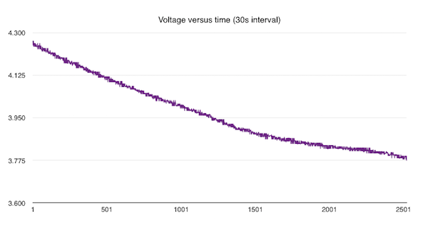
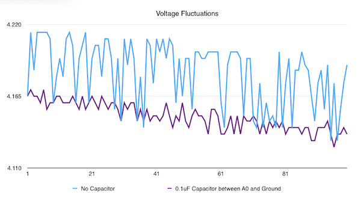
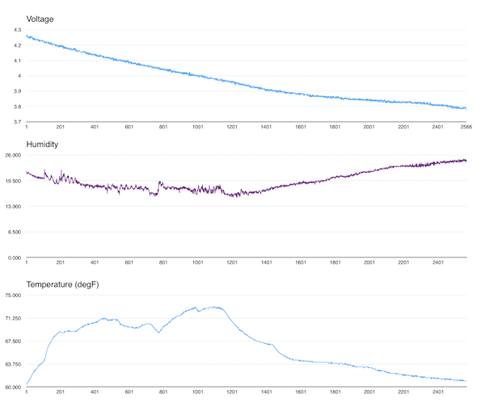
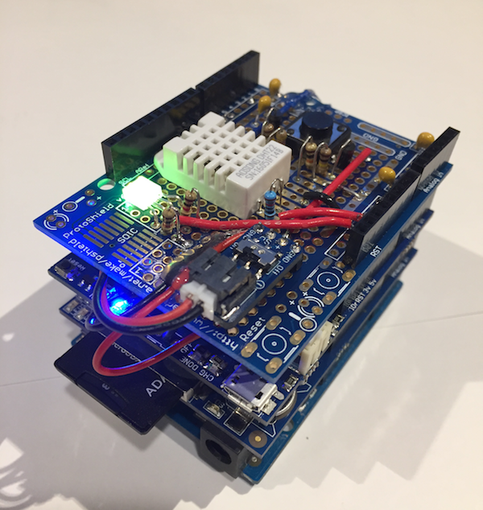
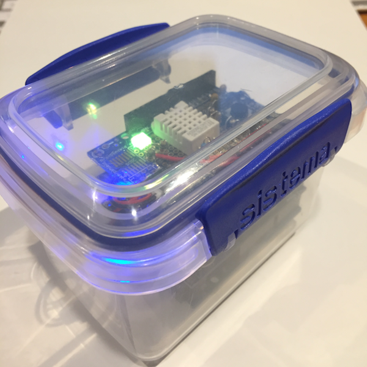

# Arduino Power

Projects involving the [Arduino](https://www.arduino.cc) family of microcontroller boards typically don't
need any special power management circuitry. You connect a power source, the device boots,
does it's job and then stops when the power is disconnected. Unlike a Raspberry Pi system, there is
no risk of corrupting an SD memory card.

But for some applications you may want to monitor power status and respond in a more managed way, instead of just shutting down.


Consider a remote sensing device that logs temperature data, for example. If the battery runs out
while it is unattended the logs simply stop. There is no way to tell immediately that low
battery was the problem. It could have been software or hardware failure.

Likewise, for a portable system, it would be helpful to know how much battery life remains and when it needs
recharging.


This project presents several approaches to Arduino power management with circuits, software and descriptions for
each of them. Starting with a simple power-on/power-off switch all the way to a data logging system that includes battery status
which is intended for unattended environment monitoring.

You can pick and choose which of the subsystems you are interested in. I'll describe all of them in increasing complexity
but you can comment out those parts you are not interested in.


The project is built on the ideas in the [LiPoPi](https://github.com/NeonHorizon/lipopi) and [Pi Power](https://github.com/craic/pi_power)
projects, which provides similar functionality for Raspberry Pi systems.

## Overview

The system provides several functions:

- Power On / Power Off using a push button
- Monitor battery voltage using the Arduino ADC
- Shutdown the system on low voltage
- Record the battery voltage and a shutdown message to file
- Display battery status using a red/green LED

I will introduce each of these in turn, but the common thread to all of them is combination of the Adafruit PowerBoost and the Arduino.

With each of these you add and customize two functions, *arduinoPowerSetup() and arduinoPowerMonitor()*, to the standard *setup() and loop()*
functions in your code.

## Adafruit PowerBoost Shield

The system uses a rechargeable LiPoly Battery and an [Adafruit PowerBoost Charger Shield](https://www.adafruit.com/products/2078),
which can both charge the battery and boost its output to 5V.

[Adafruit](https://www.adafruit.com) makes three versions of the Power Boost - two breakout boards and an Arduino Shield.
Most of the work described here uses the Power Shield, but I'll talk about using the breakout boards later on.

**Please read [This Page](PowerBoostShield.md) on how to configure the PowerBoost Shield.**

**TL;DR to prepare the Shield kit you need to:**

1. Solder on the stacking header strips
2. But do not attach the switch
3. Solder on a length of wire (4 inches, 22AWG solid core) to the Enable Pin
4. Bridge the pads for Analog pin A0 on the underside of the shield


##Power On / Power Off Circuit

This basic circuit uses the press of a momentary pushbutton switch to power up the system and, when running, to power it down -
similar to the way my phone works.

When you press and hold on a powered down system, the PowerBoost is turned on and supplies power to the Arduino which then boots up
and runs the program that you have loaded onto it.

When you press the button again, and release it, the Arduino disables the PowerBoost and, because it is no longer supplying power,
the Arduino shuts down.

**Please read [This Page](PowerOnPowerOff.md) for the details.**

**TL;DR  &nbsp; Here is the schematic :**


**Note** that you do not need this circuit to use the rest of this project. You can use the optional switch
provided with the PowerBoost shield. The primary difference is that the basic switch just shuts the system
down with no way to record a log message.

##Monitor Battery Voltage

The Arduino has 6 **Analog to Digital Converters** (ADCs) on analog pins 0-5, which makes voltage measurement
straightforward. The PowerBoost shield allows you to connect the Battery voltage (**Vbat**) to one of these by
bridging the appropriate solder pads as described on the [PowerBoost Shield page](PowerBoostShield.md). In this
example I have linked it to **Analog pin 0**.

The voltage of LiPoly batteries varies from around **4.25V** when fully charged to around **3.7V** when discharged.

The ADC converts the voltage range of **0V to 5V** into the integer range of **0 to 1023**, and we access this value
by calling **analogRead()**.

This code snippet shows how to do this as well as calculating the relative battery state using the min and max
battery voltages.

```arduino
  float maxVoltage = 4.25;
  float minVoltage = 3.75;

  arduinoPowerVoltage = float(analogRead(arduinoPowerVoltagePin)) / 1024.0 * 5.0;

  float fractionalVoltage = (arduinoPowerVoltage - minVoltage) / (maxVoltage - minVoltage);
```

LiPoly batteries do not lose voltage linearly as they discharge, but it's *close enough* that we can
estimate the remaining battery life using the fractional voltage.

So we can get the battery voltage and estimate the life remaining, but we need a way to communicate
that to the user. We could use an alphanumeric display and in the next section I will show how to
log this to a file on a SD card. But those can be overkill for many projects.

A simpler approach is to use an RGB and change the color to reflect battery life. For example:
- Green - more than 50%
- Yellow - 20% to 50%
- Red - less than 20% - time to recharge

To implement that you just add an RGB Led and two 1K resistors to the circuit and
add a bit of code to **arduinoPowerMonitor()**.

RGB Leds typically use a **Common Anode** so this circuit works with that:


**NOTE** In practice, I use the 3.3V supply with my LEDs...


**NOTE** As I will show later on, there can be a significant 'oscillation' in the measured voltage, for reasons that I don't understand.
If the battery is close to one of the values where the Led color changes, you may see it switch back and forth
between the two states - very annoying. A quick fix is to place an **0.1uF capacitor** between **analog pin A0** and **Ground**.



This breadboard layout does not show the battery or the Arduino.


The sketch [arduino_2_voltage_led](arduino_2_voltage_led) implements Power On/Power Off and Led voltage display.

The code sets the green or red pin to **low** to turn the led on and **high** to turn it off.

**NOTE** You can check the measured voltages and/or debug by uncommenting the calls to **Serial** in the code and running
the **Serial Monitor** in the IDE. You will see actual and fractional battery voltage. For some reason the
first call is incorrect.


##Logging Battery Voltage to a SD Card

The LED indicator of voltage is useful for portable, battery powered Arduino systems where you don't care too much about
the details, you just want to know when you need to recharge the battery.

But if you are monitoring sensors in a standalone system, say, then you might want to record the battery voltage
along with sensor data to give you a better idea of power consumption over time.

For this part of the project I'm using the Adafruit [Data Logging Shield](https://www.adafruit.com/product/1141) which
can record data in a **CSV** format file on the attached SD card, along with timestamps.
The [Adafruit Guide](https://learn.adafruit.com/adafruit-data-logger-shield) explains how the **SD** and **RTC** libraries work
and you should understand that before working on this part of the project.

The circuit is unchanged from the previous example - it's worth keeping the LED as it provides immediate feedback on
the battery status, but this is not necessary.

Because we are logging data to the card, it is important that we log a shutdown message. That way we can
tell if the shutdown was intentional or whether some error happened to the system.

In addition, becauase we are monitoring the voltage, we can check when the voltage drops below some minimum level
and safely shutdown the system. Again, we can log a message about that just before the shutdown.

The sketch for this is in [arduino_3_voltage_logging](arduino_3_voltage_logging).

This includes a few utility routines to generate a properly formatted timestamp string, etc. and includes
a hack to flash the red led if you forget to insert a SD card, which I do all the time...


The whole stack of Arduino Uno, Data Logging Shield, PowerBoost Shield and breadboard looks like this:




##Voltage Data##

Here is a plot of the Battery voltage over time, showing the gradual decline over a period of around 20 hours.
The decline is not truly linear but, for the purpose of estimating the remaining power, it is close enough



As I mentioned earlier, it really helps to add a 0.1uF capcitor between **Analog Pin A0** and **Ground**.
In this sample, the purple line shows the impact of the capacitor compared to the original in blue.




##Logging Environmental Data to a SD Card

To finish up, here is one more addition to the project.
One project that I have in mind is a standalone environmental monitor for my garden - temperature, soil moisture, etc.

I will install the Arduino, etc, in a sealed box that will be left unattended for some period of time.
As well as the battery running out, I want to check that no moisture gets inside the case and that it does not
experience extreme temperatures that might damage the system. A cheap and easy way to measure temperature and
humidity is the [DHT22 sensor](https://www.adafruit.com/products/385) - check out Adafruit's
[Tutorial](https://learn.adafruit.com/dht/overview) for the details.

In my example code I use **digital pin 5** instead of pin 2, as I am already using that for the Power Off button interrupt.

The code for this is in [arduino_4_voltage_temp_humidity_logging](arduino_4_voltage_temp_humidity_logging)

Once I had this working on a breadboard, I wired this up on an [Adafruit Proto Shield](https://www.adafruit.com/products/2077).
The DHT22 sensor is pretty bulky - but it is cheap. Take a look at other breakout boards from Adafruit, Sparkfun, etc for
other alternatives.

Here is what the log data looks like (2000mAh battery - approx 21 hours - in my office, all day and overnight)



Here is a photo of the complete Arduino stack:




##Ideas...

###Power Conservation in Arduino projects

The next stage in my project is to reduce power consumption and extend the battery life.

My starting point for this is excellent Adafruit tutorial on [Low Power Datalogging](https://learn.adafruit.com/low-power-wifi-datalogging/overview)
from [Tony DiCola](https://learn.adafruit.com/users/tdicola).


##Bonus Tip...

[Sistema](http://sistemaplastics.com/) is a New Zealand company that makes plastic lunch boxes, food containers, etc.

It turns out that their small *KLIP IT* containers make great cases for Arduino projects. They are relatively cheap and
come with clips and a rubberized seal. I've not tested how weather proof they are in real conditions but they look
really good.

Their [200 ml Rectangular box #1520](http://sistemaplastics.com/products/klip-it-rectangular/200ml-rectangular2) can handle a *two* board stack and
the [400ml Rectangular box #1540](http://sistemaplastics.com/products/klip-it-rectangular/400ml-rectangular) box can handle a *four* board stack.



Add a bit of foam or something like that to hold your project in place. The plastic is easy to work with if you want to
drill holes, etc.


