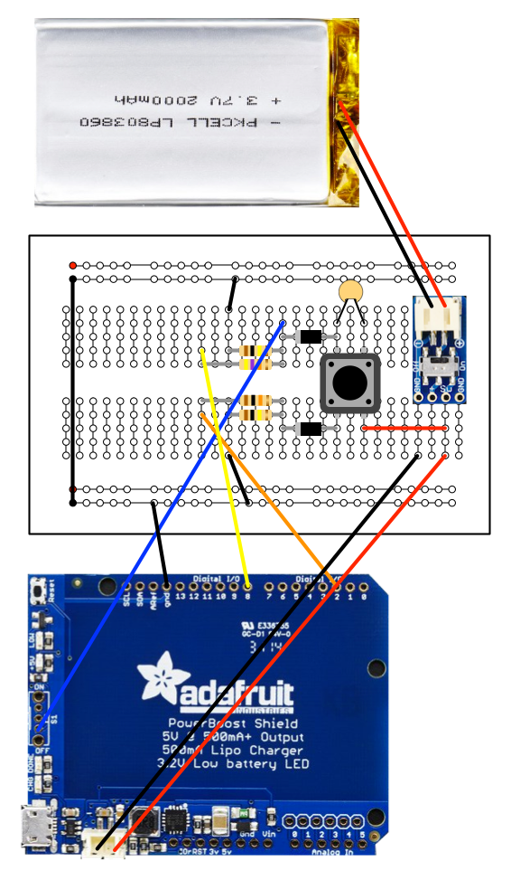

# Arduino Power

** As of 2016/11/15 this is a work in progress - not quite ready for release **

Projects involving the [Arduino](https://www.arduino.cc) family of microcontroller boards typically don't
need any special power management circuitry. You connect a power source, the device boots,
does it's job and then stops when the power is disconnected. Unlike a Raspberry Pi system, there is
no risk of corrupting an SD memory card.

But for some applications you may want to monitor power status and respond in a more managed way, instead of just shutting down.


Consider a remote sensing device that logs temperature data, for example. If the battery runs out
while it is unattended the logs simply stop. There is no way to tell immediately that low
battery was the problem. It could have been software or hardware failure.

Likewise, for a portable system, it would be helpful to know how much battery life remains and when it needs
recharging.


This project presents several approaches to Arduino power management with circuits, software and descriptions for
each of them. Starting with a simple power-on/power-off switch all the way to a data logging system that includes battery status
which is intended for unattended environment monitoring.


The project is built on the ideas in the [LiPoPi](https://github.com/NeonHorizon/lipopi) and [Pi Power](https://github.com/craic/pi_power)
projects, which provides similar functionality for Raspberry Pi systems.

## Overview

The system provides several functions:

- Power On / Power Off using a push button
- Monitor battery voltage using the Arduino ADC
- Shutdown the system on low voltage
- Record the battery voltage and a shutdown message to file
- Display battery status using a red/green LED

I will introduce each of these in turn, but the common thread to all of them is combination of the Adafruit PowerBoost and the Arduino.


## Adafruit PowerBoost Shield

The system uses a rechargeable LiPoly Battery and an [Adafruit PowerBoost Charger Shield](https://www.adafruit.com/products/2078),
which can both charge the battery and boost its output to 5V.

[Adafruit](https://www.adafruit.com) makes three versions of the Power Boost - two breakout boards and an Arduino Shield.
Most of the work described here uses the Power Shield, but I'll talk about using the breakout boards later on.

**Please read [This Page](PowerBoostShield.md) on how to configure the PowerBoost Shield.**

**TLDR; to prepare the Shield kit you need to:**

1. Solder on the stacking header strips
2. But do not attach the switch
3. Solder on a length of wire (4 inches, 22AWG solid core) to the Enable Pin
4. Bridge the pads for Analog pin A0 on the underside of the shield


##Power On / Power Off circuit

This basic circuit uses the press of a momentary pushbutton switch to power up the system and, when running, to power it down.

When you press and hold on a powered down system, the PowerBoost is turned on and supplies power to the Arduino which then boots up
and runs the program that you have loaded onto it.

When you press the button again, and release it, the Arduino disables the PowerBoost and, because it is no longer supplying power,
the Arduino shuts down.

With the more complex versions of this, the system logs a shutdown message, etc., before actually shutting down.

###How this works

The PowerBoost has an **Enable pin** which is held HIGH by default. In this state, the PowerBoost is enabled and supplies power
via the 5V pin on the Arduino headers. The Blue LED on the shield is lit when it is supplying power.

If that pin is connected to ground, through **R1** in the schematic below, then the PowerBoost is disabled and does not provide power.

You add two functions, **ArduinoPowerSetup** and **ArduinoPowerMonitor**, to your code which configure **digital pins 8 and 9**
as input and output, respectively.


####Power On

When the pushbutton is pressed, the battery voltage is connected to the **Enable pin** and pulls it HIGH, which turns on the
PowerBoost output and which, in turn, boots the Arduino.

The **ArduinoPowerSetup** function, included in your program, sets Arduino **digitial pin 9** to **output** and HIGH.
This ensures that the **Enable pin** remains high when the pushbutton is released, ensuring that the PowerBoost remains on.

####Power Off
The **ArduinoPowerSetup** function has configured Arduino **digital pin 8** as an input and resistor **R3** pulls this LOW.

On a running system, pressing the pushbutton again, pulls **pin 8** HIGH. The **ArduinoPowerMonitor** function
in your program monitors this and sets **pin 9** to LOW.

This should set the **Enable pin** to LOW and turn off the PowerBoost. However, because the pushbutton is **down**, the
**Enable pin** remains HIGH given the voltage from the battery. It is only when the pushbutton is **release** that voltage is removed
and the **Enable pin** is pulled LOW, turning off the PowerBoost and Arduino.

####The hack...

In essence, there are two separate circuits connected to the pushbutton - the **power on** path and the **power off** path.

The role of the two 1N4001 diodes is to direct the current flow from the battery when the pushbutton is pressed and to avoid
any unwanted current paths.

When you **power on** the device, you also set up the **power off** function - and *if you keep the pushbutton pressed for
too long then the Arduino will power off the PowerBoost immediately.*

To handle this, the **ArduinoPowerSetup** function calls a **3 second delay()** before entering the main program loop.

Here are the current paths in the four states:


####The Circuit

To wire up this circuit, using the PowerBoost Shield, we need another hack as the board does not provide
a direct connection to the Battery positive lead. You can access this via one of the **analog pins** as described on
the [PowerBoost](PowerBoostShield.md) page, **BUT** that pin has 2K resistor in series to limit current. In its powered down state
there is only around 1.5 V on this pin, which is not enough to pull the **Enable pin** HIGH.

The workaround is to not plug the LiPo battery directly into the PowerBoost Shield. Instead use a
[Switched JST-PH 2-Pin SMT Right Angle Breakout Board](https://www.adafruit.com/products/1863) ($2.50) and a
[JST 2-pin cable](https://www.adafruit.com/products/261) ($0.75) and take off the Battery voltage from the positive lead
on a breadboard.

**Note** This layout leaves out the actual Arduino as that is part of your stack with the PowerBoost



**Note** the switched JST breakout board is useful as you can switch off the battery when you are uploading your code via USB, which
itself provides power to the Arduino. Not necessary, but I prefer to isolate the two power sources.

####Example code

[arduino_1_power_on_power_off](/arduino_1_power_on_power_off) is the example application for these functions. Aside from power control, all it does is
blink the **onboard** LED attached to **pin 13**.

There are two global variables and two functions, **arduinoPowerSetup() and arduinoPowerMonitor()** that you can
add to your code. Here is the arduinoPower-*specific* code:


```arduino
// Global variables for Arduino Power
const int arduinoPowerEnablePin   =  9;
const int arduinoPowerButtonPin   =  8;

void arduinoPowerSetup() {
  // When the Arduino boots, set the Enable Pin high and leave it
  // This keeps the Powerboost Enable pin High and therefore running
  pinMode(arduinoPowerEnablePin, OUTPUT);
  digitalWrite(arduinoPowerEnablePin, HIGH);

  // Set up the Button Pin to act as an input
  pinMode(arduinoPowerButtonPin, INPUT);

  // need to delay for three seconds to allow the Arduino to 'boot'
  // before starting to monitor the pushbutton in shutdown mode
  delay(3000);
}

void arduinoPowerMonitor() {
  // shutdown the PowerBoost when the button is pressed while Arduino
  // is running - this only works when the button is released...
  // This is because the power-up circuit is activated when the button is down

  if (digitalRead(arduinoPowerButtonPin) == HIGH) {
    digitalWrite(arduinoPowerEnablePin, LOW);
  }
}
```

**Note** you can use different Arduino pins but you might want to avoid pins 10-13 as these are used in the
Serial Peripheral Interface (SPI).


